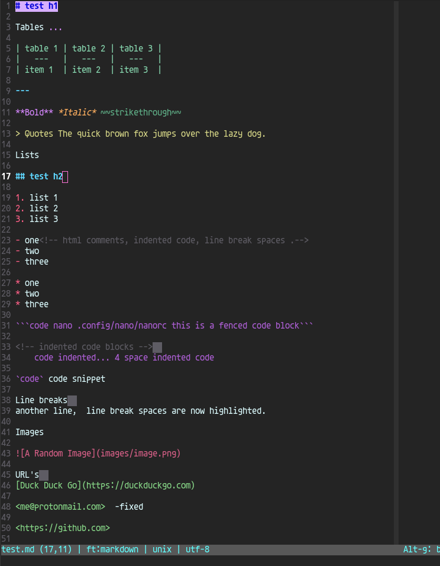
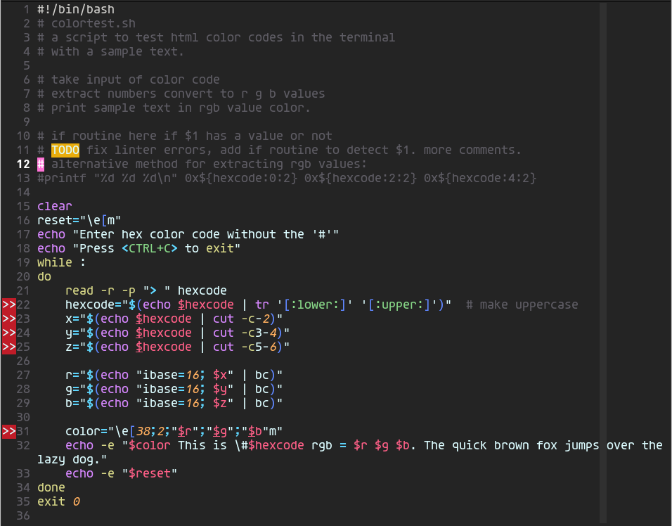

# micro-syntax
Micro text editor alternative syntax highlighting and colorschemes.

## markdown
markdown.yaml with additions, line break spaces, tables, more url's, images,emphasis separated into bold, italic and strikethrough. Indented code highlighting and html comments.

## bash
sh.yaml with shebang highlighting, sudo, brackets and additional url highlighting. Still needs work.

## colorschemes

### bashmd.micro
A scheme set up for dark theme terminals using a true-color pastel pallete, specifically for the syntax-highlighting files above. Colors will vary depending on the terminal used, works on 256-color and true-color terminals.

### blank.micro
A blank colorscheme with all possible entries included, just add colors.

### Screenshots
Markdown

Shell Scripts

